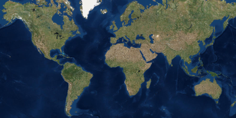

# zoom and rotation testing app

This project has been created to look at differences between JavaFX gestures on Windows, Linux and Mac.

I have observed that using an ImageView control, when listening to ZoomEvent and RotateEvent there are differences between desktop platforms:
 - Windows with touch screen - all fine, both fire as expected
 - macOS using touchpad - all fine, both fire as expected
 - Ubuntu with touch screen - neither of the events are fired

## Licensing

Licensed under the Apache License, Version 2.0 (the "License"); you may not 
use this file except in compliance with the License. You may obtain a copy 
of the License at

http://www.apache.org/licenses/LICENSE-2.0

Unless required by applicable law or agreed to in writing, software 
distributed under the License is distributed on an "AS IS" BASIS, WITHOUT 
WARRANTIES OR CONDITIONS OF ANY KIND, either express or implied. See the 
License for the specific language governing permissions and limitations 
under the License.

A copy of the license is available in the repository's license.txt file.
